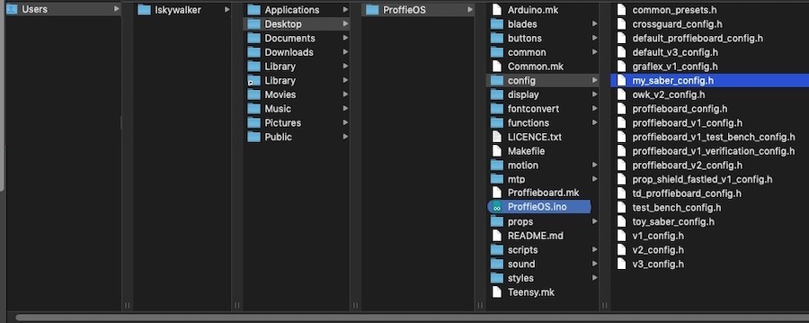
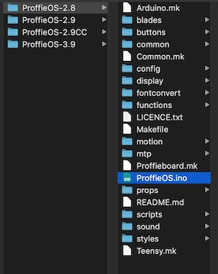
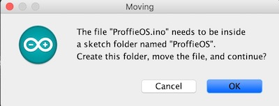
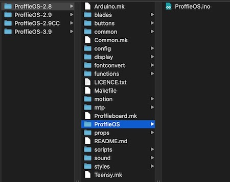
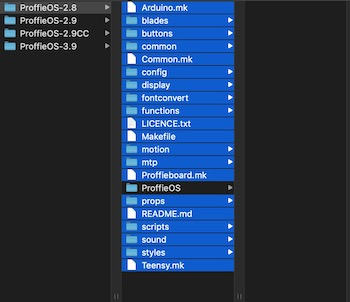
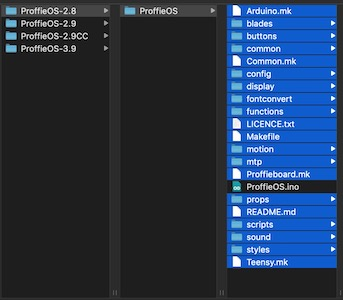

Short version first:

The ProffieOS.ino file must be in a folder named ProffieOS.
Your config file (my_saber_config.h or however you named yours) must be in the config folder that is inside the SAME ProffieOS folder as the ProffieOS.ino file you are using in Arduino.
So the paths to these files would look like this in Windows:
>C:\Users\Fredrik\Desktop\ProffieOS\ProffieOS.ino
>C:\Users\Fredrik\Desktop\ProffieOS\config\my_saber_config.h

Or graphically in MacOS:

Longer detailed version:

 Some common problems often heard in the forums and saber board pages:

- "After making some changes to my config (such as a new preset, blade style, or a font etc...) everything compiles and uploads successfully to the board. However, when powering on the saber, it seems nothing has changed." NOTE - If you use #define SAVE_STATE in your config, you might not have changes take effect until you try deleting the generated files from the root level of your SD card named preset, curstate, and global. It's OK, they get replaced next time you run a preset. 
- "After downloading and unzipping the ProffieOS package, Arduino says something about a ProffieOS folder and offers to create one and move something, and after clicking OK, nothing compiles."

Issues like these are a very simple fix, but some basic understanding of file and folder hierarchy is needed.

Note that as of the latest version, simply unzipping the software package creates the correct folder structure, whereas previously, some versions have required renaming folders and moving files and folders into a ProffieOS folder, and not everyone maintained the hierarchy correctly in doing so.

ProffieOS code is using files which it expects to be in a certain place. It uses paths to files, which you've probably seen and used before, See above for examples.

The root folder for the software (top level folder) must be named ProffieOS. The ProffieOS.ino file that you open in Arduino must live in this folder. Subfolders of the ProffieOS folder contain the files the code needs (blades, common, config, props, and so on).
When you have downloaded multiple versions and copies of the software, including forks and prop files, you need to keep everything organized to avoid mixing up which files you're currently using and working with.

It is recommended that you create a folder somewhere, either on the Desktop or in "Documents" where you keep lightsaber stuff. Then inside that, have one directory per ProffieOS version, and inside that, it would be ProffieOS/ProffieOS.ino, so something like:

The written path in full could look like this:
C:\Users\Hubbe\Documents\Lightsaber Stuff\ProffieOS-2.8\ProffieOS\ProffieOS.ino

Another reasonable alternative is to organize things by saber, which could look like:
C:\Users\Hubbe\Documents\Lightsabers\Graflex\ProffieOS\ProffieOS.ino

Or, if you have multiple versions of ProffieOS for each saber (like I do):                          
C:\Users\Hubbe\Documents\Lightsabers\Graflex\ProffieOS-2.8\ProffieOS\ProffieOS.ino

Let's say you currently have everything contained in a folder named ProffieOS-2.8
 and you try to open the ProffieOS.ino file in Arduino.

You get a message saying "The file "ProffieOS.ino" needs to be inside a sketch folder named "ProffieOS". Create this folder, move the file, and continue?"

If you agree, the ProffieOS.ino file you tried to open gets moved into a newly created subfolder called ProffieOS, and the sketch opens. However, this only moved the .ino and left all of the files that the software needs outside the new folder.

You need to structure this folder correctly before you can compile the code. 
Take all the folders next to ProffieOS and place them inside WITH ProffieOS.ino.

 

The usual problem is that the wrong version of ProffieOS/config/my_saber_config.h is being edited, one from an older version folder, while the newer ProffieOS.ino is being used in Arduino. The relative paths are the same from the ProffieOS folder and down, but the path prior is different. It's hard to put into words, but just make sure you edit the correct config file, and that you #define it in Arduino.